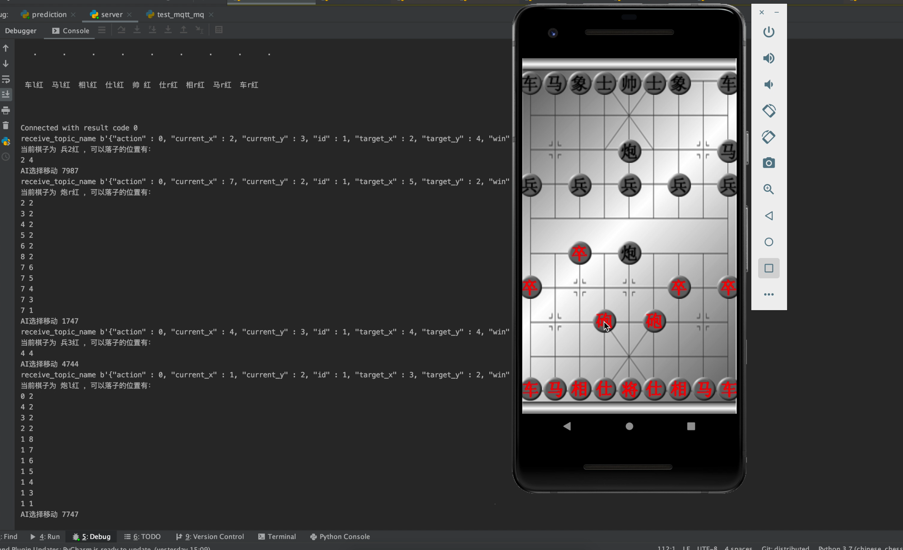
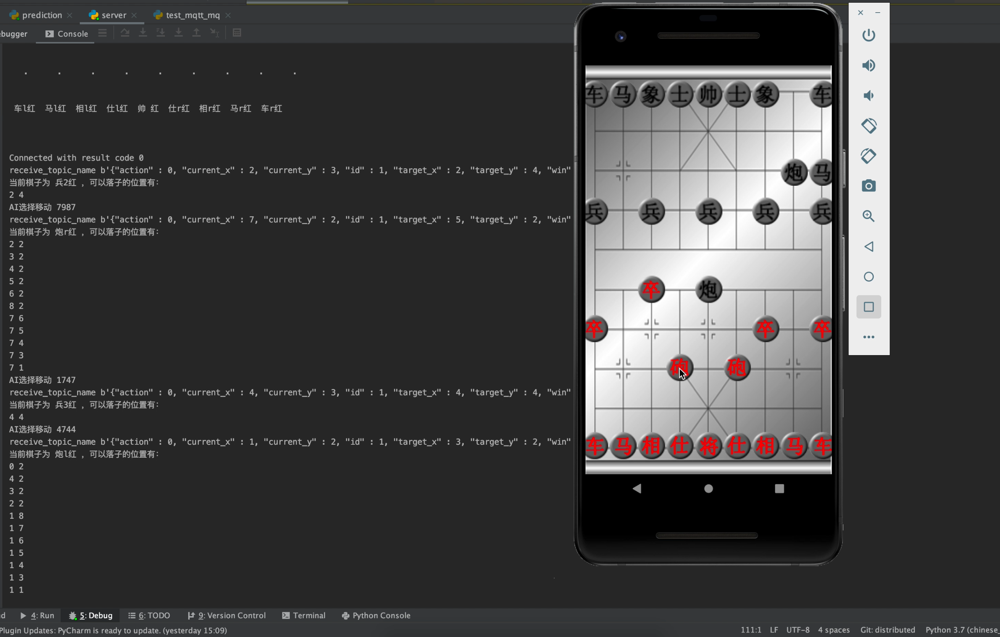

# ChineseChess

中国象棋安卓端，后端使用AlphaZero训练的模型，进行AI下棋。

客户端主要流程为：
* 进入游戏后向后端发送注册信息，后端初始化一个游戏房间
* 客户端控制UI操作，包括能否在指定的位置落棋，当然后端也会同时校验。
* 在前端操作合法的情况下，像消息队列ActivitMQ发送消息，通知人的操作
* 通过消息队列接收服务端AI的下棋步骤，客户端进行UI的绘制。

人操作为红棋
AI为黑棋

